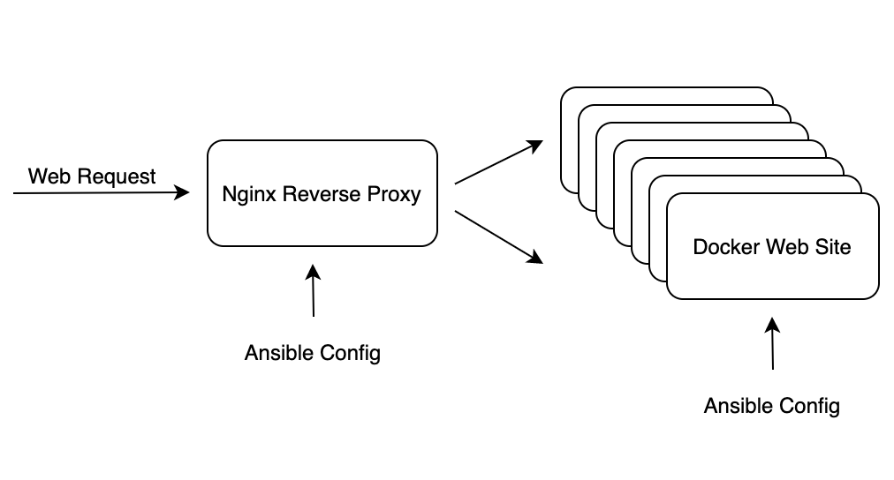

# Python Django Demo

- Github：<https://github.com/wu-wenxiang/ZZLARGE-Project-DjangoTest>
- 同步到：<https://gitee.com/wu-wen-xiang/project-django-demo>

## 1. 本地运行代码

- Python3.5+
- `.\test.sh`
- `.\start.sh`
- Fabric 一键部署：Ubuntu 1604，[Gitbub](https://github.com/wu-wenxiang/Project-Python-Webdev/tree/master/u1604-fabric) 或 [Gitee](https://gitee.com/wu-wen-xiang/project-python-webdev-demo)

## 2. 制作 Docker 镜像

1. 确认本地 Docker Daemon 正常运行

	```console
	$ docker run hello-world

	Hello from Docker!
	...
	```

1. 切换回本项目的根目录，确认目录中包含 Dockerfile 文件

	```console
	$ ls
	Dockerfile    README.md     ansible-u1804  mysite    docker-config  requirements.txt

	$ docker build -t maodouzi/django-test-1.11.29 .
	```

1. 在本地测试和运行 Docker 镜像，然后在浏览器上访问: `http://localhost`

	```console
    $ mv mysite/data/db.sqlite3 ~/Desktop/ && docker pull registry.cn-shanghai.aliyuncs.com/99cloud-sh/django:1.11.29 && docker build -t maodouzi/django-test-1.11.29 . && mv ~/Desktop/db.sqlite3 mysite/data/db.sqlite3 && docker run -d --rm --name="djangotest-1.11.29" -p 80:80 --mount type=bind,source=$(pwd)/mysite/data,target=/home/www/mysite/src/mysite/data maodouzi/django-test-1.11.29:latest && docker ps

	$ docker run -d --rm --name="djangotest-1.11.29" -p 80:80 --mount type=bind,source=$(pwd)/mysite/data,target=/home/www/mysite/src/mysite/data registry.cn-shanghai.aliyuncs.com/99cloud-sh/djangotest-1.11.29
	221fc877103e55b6a452e8d69838232e122a357972aa08ac4421212395b892bf
	```

1. 停止 Docker 镜像

	```console
	docker stop 221fc877103e55b6a452e8d69838232e122a357972aa08ac4421212395b892bf
	```

1. 镜像上传到 registry hub

	```bash
	docker login
	docker push registry.cn-shanghai.aliyuncs.com/99cloud-sh/django:1.11.29
	```

## 3. 部署到远端站点

1. 配置 ~/.ssh/config 文件，HostName 可以直接写 IP 地址，IdentityFile 是密钥文件，可以用 ssh-keygen 生成，然后通过 ssh-copy-id 拷贝到远端机器上取。

	```
	Host djangotest
	    HostName        djangotest.demo.com
	    User            root
	    IdentityFile    ~/.ssh/id_rsa_test
	```

1. 确认能不用用户名密码，直接访问远端机器

	```console
	$ ssh djangotest
	Welcome to Ubuntu 18.04.3 LTS (GNU/Linux 4.15.0-52-generic x86_64)
	...
	Last login: Wed Nov  6 18:47:17 2019 from 116.238.98.242
	```

1. 切换到 ansible-u1804目录，复制 `inventory/inventory.ini.example`，并修改 webserver 的名字

	```console
	$ ls
	README.md inventory playbooks

	$ cp inventory/inventory.ini.example inventory/inventory.ini

	$ cat inventory/inventory.ini
    ...

	[webserver]
	djangotest
	```

1. 执行部署

	```console
	$ ansible-playbook -i inventory/inventory.ini playbooks/deploy.yml

	PLAY [webserver] *****************************************************************************************************************

	TASK [Gathering Facts] ***********************************************************************************************************
	ok: [djangotest]

	TASK [init01_pre_install : apt-get update] ***************************************************************************************

	...
	```

1. 执行完毕后，可以通过浏览器访问远程机器

## 4. 如何一个 VM 托管多个站点？

前面加一个 Nginx 做统一的反向代理，用 Ansible 推送配置。


